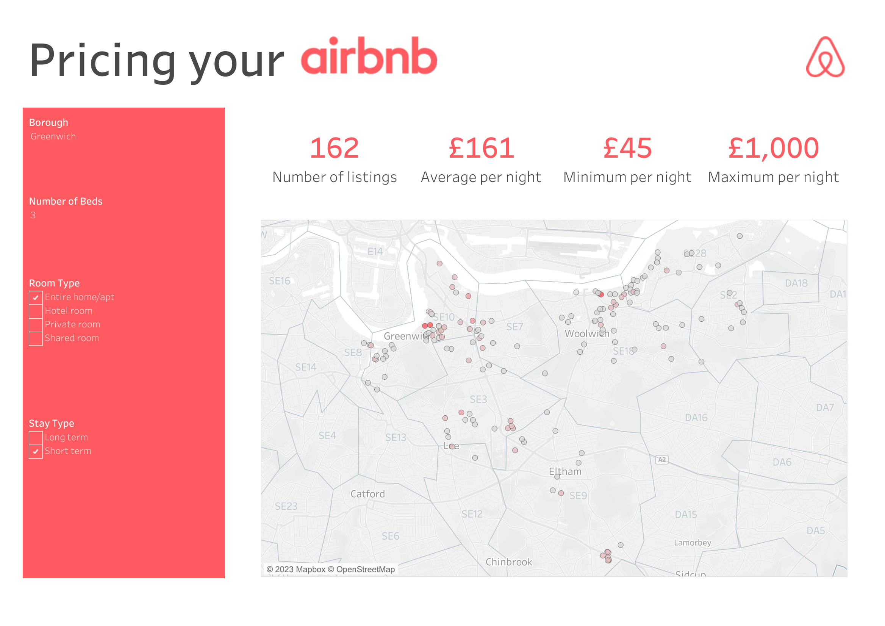

# Airbnb - a dashboard built in Tableau

## Overview
I designed and built a dashboard for prospective airbnb owners to help them to make decisions about appropriate pricing for their airbnb. I used a public dataset from kaggle which contains information from airbnb about room type, price and location. I cleaned the data in Tableau, including using regex to split a column and extract 'number of beds'. The dashboard allows users to filter by their type of airbnb: location, number of beds, length of stay and room type. The dashboard displays key summary statistics about similar properties and a map they can use to explore pricing of individual local airbnbs.

[View the dashboard in full and download the tableau workbook](https://public.tableau.com/app/profile/kat4197/viz/airbnbpricingdashboard/Dashboard1) from tableau public.

## Dataset
The dataset was sourced from [here](http://insideairbnb.com/get-the-data), I used the listings csv which has 18 columns and 81000 rows containing listings details. 

## Acknowledgements and caveats
* [Inside Airbnb](http://insideairbnb.com/) for providing the dataset
* This work is not affiliated with airbnb in any way
